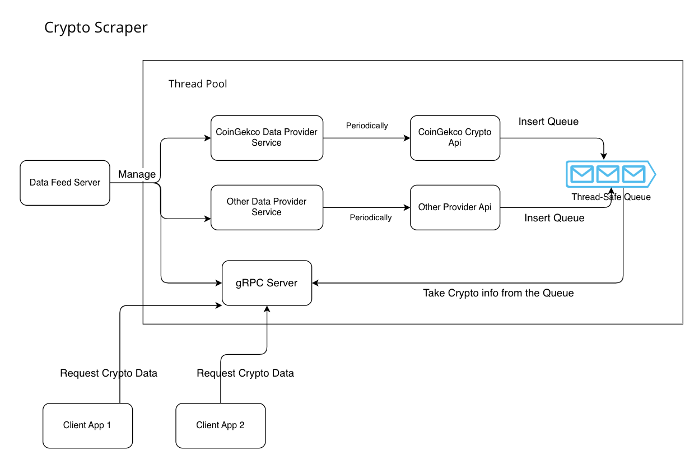

# crypto-scraper
A Simple Crypto Scraper written in .NET Core, Technologies used in this project, Worker Services, gRPC, Multi-Threading.

## Author
Tea Binxiong

## Description
This repository consists of a **Data Feed Server** and 2 **Data Client App**. The ***Data Feed Server** scrapes specific crypto details from the CoinGecko API and stores them inside a queue. The **Data Client Service** then retrieves the crypto details from **Data Producer Service** via the **gRPC** protocol.

## Architecture Diagram


## Future Improvement
1. Add more Scraper Api from different source. Currently only has api from CoinGecko.


## Projects:
1) Server Project 1 - Crypto.Scraper.DataFeedServer
2) Client Console App 1 - Crypto.Scraper.ClientApp
3) Client Console App 2 - Crypto.Scraper.ClientApp


## Architecture Diagram

## Quick start guide

- Step 1: Register a Gekco Demo Account to obtains a demo api key

- Step 2: Replace the CryptoApiKey in the appsettings file in the Crypto.Scraper.ProducerServer project.

- Step 3: Navigate to the Crypto.Scraper.ProducerServer folder in the command line and then run the project by entering the following command:
  ```
  dotnet run
  ```
- Step 4: Navigate to the Crypto.Scraper.ClientApp folder in the command line and then run the project by entering the following command:
  ```
  dotnet run
  ```
- Step 4: Navigate to the Crypto.Scraper.ClientApp2 folder in the command line and then run the project by entering the following command:
  ```
  dotnet run
  ```

## Repository URL
[crypto-scraper](https://github.com/teabinxiong/crypto-scraper)


